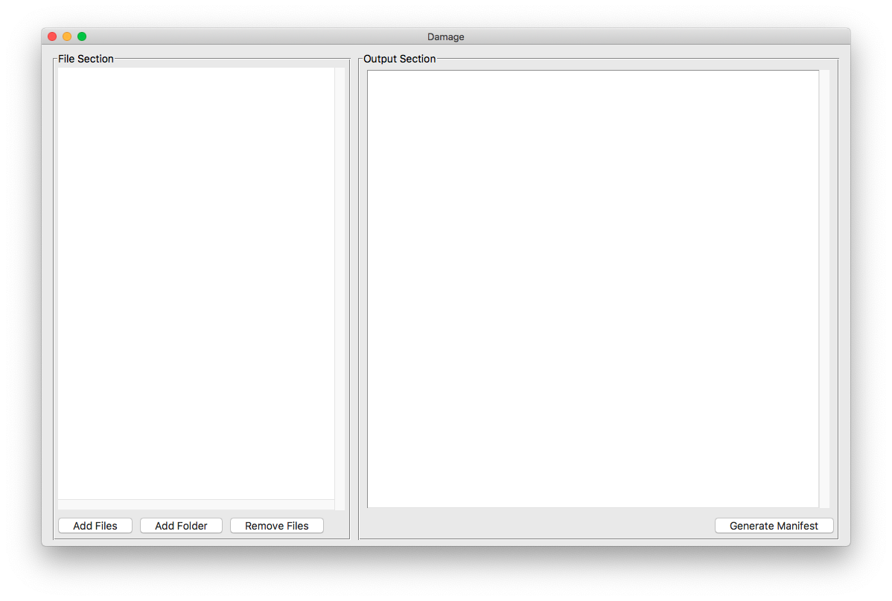
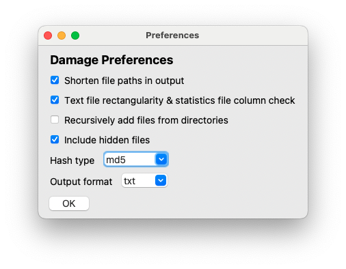
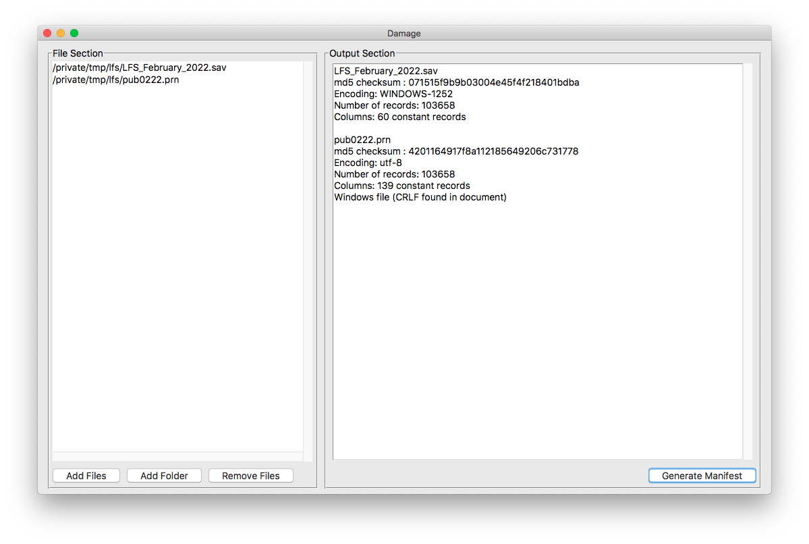
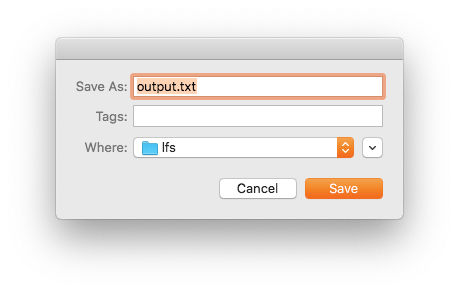

# How to use the Damage application

## Installation

For all versions of **Damage**, download the latest release for your platform from the [Github releases page](https://github.com/ubc-library-rc/fcheck/releases). Note that releases for all architectures are not available. Notably, there are no versions for Apple M1 processors nor ARM architecture at the present time.

Ironically, **Damage** could check the integrity of your download by verifying its checksum. If you wish to do so (and it's good practice to do so), you could use the **damage** command line tool or another utility such as **openssl**.

### For Microsoft Windows

The Windows application is a portable file; it does not require installation. Simply unzip it and run **Damage.exe**. Note that the console utility, if it's installed is called **damage.exe** and the application is called **Damage.exe**, with an uppercase D. On most Windows computers, this is a distinction with out a difference. You should ensure that only one of the applications, usually **damage.exe**, is on your `%PATH%`.

### For MacOS

Double-click the DMG file, and it should automatically appear in a Finder window. Drag the icon to the Applications folder. If, for some reason, you don't want to put it in the Applications folder, you can drag it somewhere else.

Note that the developer(s) of **Damage** do not have an Apple developer account. This means that you may recive a warning about an unidentified developer as per this page: <https://support.apple.com/en-ca/guide/mac-help/mh40616/mac>. To start the application (for the first time only), you may have to right click on the application, select **Open** then agree to the conditions.

You can, of course, disagree, but that would defeat the purpose of downloading it.

### For Linux

Unzip the download. Like the Windows utility, it is a single file. Traditionally, you can place that file in `/usr/local/bin` or `opt/bin`, or if that is not a solution, another user-centred location is `~/.local/bin`.

## Usage

On running the application, you will be presented with an essentially blank interface.

The workflow consists of the following easy steps:

0. Set your preferences
1. Select files
2. Create the manifest
3. Save (or print) the output

### The Preferences window

The output of **Damage**, like all other software, will be dependent on the preferences you set. While the defaults are fine, you may need to match your output to someone else's manifest, or you don't like what the defaults are. To do this, use the Preferences window, available via the *Edit/Preferences* menu item.

**The options**

* **Shorten file paths in output**: Given a list of files, the common portion of the file path will be removed in the output. For example, given two files `path/to/dir_a/x.txt` and `path/to/dir_b/y.txt`, the output will show `dir_a/x.txt` and `dir_b/y.txt`.

* **Rectangularity check**: For plain text files and statistical software files, check for line length and number of records. If a text file is meant to be a rectangular file, ie, each record or line contains the same number of observations, thus having the same line length, then the output will show `constant records`, and all the lines will have the same length. In the case of statistical files, the line length refers to the number of **fields**, ie, variables. If, for instance, the value is not constant, that means that the data set is truncated.

* **Recursively add files from directories**: When adding a folder, add all the files found in sub-folders as well. So, if folder A contains folders B and C, any files found in A, B and C will be added, all the way to to the point where no further folders are found.

* **Hash type**: Cryptographic hash algorithm used to check for file integrity. The most commonly used are likely `md5` and `sha256`. If checking downloaded files for integrity, use the algorithm stated on the download site. For example, on the release page for this software product, you will see that the download checksums are listed as `sha256`. If checksums don't match, then file integrity is compromised.

* **Output format**: Output format of the resulting manifest.
	* txt: Human readable plain text format
	* csv: Comma separated value spreadsheet
	* json: Javascript Object Notation dictionary for times when machine readable output is required.

### Selecting files

You have several options to select files to analyze. Add individual files with either the *Add Files* button or the the menu under *Files/Add Files*

If you would like to add an entire folder of files, select the *Add Folder* button or the *Files/Add Folder* menu.

Files (with their full paths) will be added to the left sidebar, or *File Section*. 

In some cases, what seems like a file doesn't appear in the list. For instance, should you attempt to add a Mac application (which, in the Finder, looks like a single item), it will be ignored. Mac Applications are really folders, despite looking like single files. Should you really need to add an item such as this, use the *Add Folder* function.

### Removing files

If you wish to edit the list of files, select the files you wish to remove from the *File Section* and use the *Remove Files* button, or use the convenient menu item *Files/Remove Files*

### Generating the manifest

To generate the manifest for your selected files, hit the *Generate Manifest* button, use the *Actions/Create Manifest* menu item, or use the plaform specific short combination. Note that this operation may take a while depending on the size and complexity of the file(s) you are analyzing. Notably, statistical files with hundreds of thousands of records (or millions) may take a while. Don't assume the application has crashed if results are not instant.

Once completed, the output is shown in the cleverly labelled *Output Section*. At this point, you can edit the results (although it's not clear why you would). More importantly, though, the saving and printing options will now be available.

### Output

To save, select *Actions/Save Output* or use the shortcut key combination. The output will be saved with the correct extension automatically.

To print, select *Actions/Print Output* or use the shortcut key combination. The output will be sent immediately to your default printer. 

**Note**: There is no printer selection and formatting dialogue; the manifest is sent to the printer as plain text. Note that in the case of csv files, this means that you will get raw csv, not a nice table.

If you require nicely tabulated and formatted data, use a spreadsheet to open the created csv file.

### The Help menu

* **Damage help**: takes you to this page. Obviously, this requires an internet connection, but what doesn't these days

* **Credits and Details**: Developer information as well as links to the source code.

## What is the point of this?

**Damage** is designed to ease the distribution of data by providing a standardized listing of checksums and record lengths, which ideally will be distributed with the data set itself. This allows end-users to duplicate the procedure and compare results.

### If you're a data provider

Use **Damage** to create a data manifest which you distribute with your data and documentation. This will allow users to verify that they have *exactly* what you intend them to have.

### If you're a data user

Use **Damage** to verify that what you've received from a data provider is what they're supposed to have given you.

### Bonus points

If both parties shorten file paths and use the same directory structure, then the *manifests* can be compared. If the checksums of the manifests are not identical, then the data structures are not identical.
