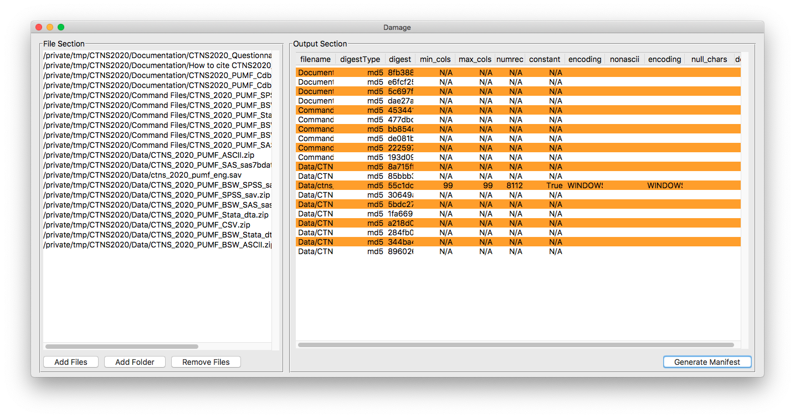

# File manifest tools: Damage

## Overview


**Damage** (either DAtaMAnifestGEnerator or a wizard, your choice) is a simple multi-platform utility which creates file manifests in a variety of formats. It was created to deal primarily with statistical data, but it also functions as a generalized file manifest tool. 

### Multiple flavours!




**Damage** comes as both a traditional application (with a handy user interface) or as console utility running in your  Windows command prompt/PowerShell/bash session.

Download the newest binary version of Damage here:

[<button>Download Damage</button>](https://github.com/ubc-library-rc/damage/releases)

A created manifest includes, for all file types:

* The file name
* Checksum in your choice of hash for the file. Current flavours of hashes are: sha1, sha224, sha256, sha384, sha512, blake2b, blake2s, md5 
* Encoding, if available (ie, utf-8, windows-1252, etc.)

For **plain text files**, often used for microdata, the utility also produces information on:

* Minimum line length
* Maximum line length
* Number of records
* Constant records flag (ie, all lines are of the same length)
* Row and column of non-ASCII characters
* A count of null characters
* Flag for DOS/Windows formatting (ie, carriage return + line feed as opposed to just a line feed).

For files in **SAS, SPSS and Stata formats** (ie, .sas7bdat, .sav and .dta) the utility will provide information on:

* Number of cases (reported as rows)
* Number of variables (reported as columns)

Note that statistical package files will always be reported as rectangular due to the limitations of parsing them.

Output formats are:

* Plain text
* Comma Separated Value (ie, a spreadsheet), and depending on which application, tab-separated or pipe-separated values
* JSON. This JSON doesn't conform to any particular standard, but is valid JSON object — one object for all the files. The command line program will produce output in the format of:

```
{"files":[{file1medata}, {file2metadata}, ...{fileNmetadata}]}
```

### But that's not all!

#### The damage module

While standalone pieces of software are what most people will use, the underlying checking mechanism is available as a Python module also called **damage** which you can use in your own software.

## Why would I need this?

More than ever, the world today revolves around data sharing. Knowing the data that you've downloaded is *correct* is key.

**For data distributors**

* _damage_ output can be included as a text file with your data so that you and end users can verify and identify what they've downloaded
* Create detailed version notes with one command
* Manage changes in file structure using digests which are unique to a particular version of a file, instead of relying on easily changeable file names
* Easily find duplicate files

**For researchers**

* _damage_ an help with creating descriptive documentation which is required for your research data deposit
* _damage_ output ensures the integrity of your data set when used by others
 
## Detailed software/installation instructions

There are many ways to install **damage**. Which one is best for you depends on your 

### Using **pipx**

Using [pipx](https://pipx.pypa.io/latest/) is the easiest way to make sure things are up-to-date. Use this if you:

* Are happy using the terminal/command line
* Are unlikely to use the _damage_ package in your own code

`pipx install damage`

Caveats: Although everything will be installed, you will need to invoke the Damage GUI application from the terminal/command line. Such is the price of convenience. Because _pipx_ is also a package manager, this means that you can use _pipx_ itself to update everything using its own update features

### GUI application only

Use the download button above to download the GUI application. Releases may include precompiled **damage** applications for various plaforms, mostly MacOS and Windows. The availability of stand-alone application (.exe, .app bundle, whatever) will depend on how much spare time I have to compile everything.

### Installing with pip 

If you are Python user, you can install in the normal, pythonic way, from PyPi:

```nohighlight
pip install damage
```

And if you want to use a particular branch, commit, or some other specialized branch:

```nohighlight
pip install git+https://github.com/ubc-library-rc/damage.git@master
```

Note that the parts after `.git` can be customized to whatever you need.

Installing with `pip` makes the package code easily available in your own software.

Documentation on the module is available via the [API reference documentation](api_reference.md).

### Source code

As you may have surmised from the example above, source code is available at <https://github.com/ubc-library-rc/damage>, along with all of the documentation and binary files. That will likely not surprise you if you are reading this.
